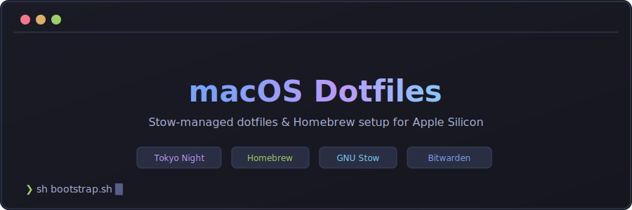

# macOS Setup

<p align="center">
  
</p>

One command to set up a new Mac with all your apps, terminal configs, and system preferences.

## What It Does

1. **Apps** — installs all your applications and CLI tools via Homebrew
2. **Dotfiles** — configures your terminal, shell, editor, git, and dev tools
3. **macOS** — sets system preferences (Dock, Finder, keyboard, security)

## Quick Start

Open Terminal on a fresh Mac and run:

```sh
# Download and run
git clone https://github.com/<your-user>/macos-dotfiles.git ~/.macos-dotfiles
cd ~/.macos-dotfiles
sh bootstrap.sh
just install
```

That's it. Your Mac is set up. Restart your terminal to see the changes.

> **Not a fresh Mac?** If you already have config files (like `~/.zshrc` or `~/.gitconfig`), stow will refuse to overwrite them. Back up and remove the existing files first, then run `just stow`. Your old configs won't be lost — just move them aside (e.g. `mv ~/.zshrc ~/.zshrc.backup`).
>
> **Optional:** To set up git identity, GPG keys, and AWS credentials from Bitwarden, see [Secrets Setup](#secrets-setup) below.

## Day-to-Day Commands

| Command | What it does |
|---|---|
| `just update` | Install new apps, remove old ones, clean up |
| `just doctor` | Check that everything is working |
| `just theme` | Switch your terminal color theme |

## Customizing

### Add or remove apps

Edit `apps/Brewfile` — one line per app:

```ruby
brew "ripgrep"           # CLI tools use 'brew'
cask "firefox"           # Desktop apps use 'cask'
```

Then run `just update` to apply changes.

### Change terminal/editor settings

Config files live in `dotfiles/stow/`. Each folder maps to a tool:

| Folder | What it configures |
|---|---|
| `zsh/` | Shell config, aliases, plugins |
| `fish/` | Fish shell config |
| `git/` | Git config, aliases, global gitignore |
| `nvim/` | Neovim editor |
| `ghostty/` | Ghostty terminal |
| `starship/` | Terminal prompt |
| `bat/` | `cat` replacement with syntax highlighting |
| `lazygit/` | Git terminal UI |
| `btop/` | System monitor |
| `k9s/` | Kubernetes dashboard |
| `mise/` | Programming language versions (Java, Node, Python) |
| `aws/` | AWS CLI defaults |
| `direnv/` | Per-project environment variables |
| `ripgrep/` | Search settings |
| `fastfetch/` | System info display |

Edit any file, then run `just stow` to apply.

### Change macOS preferences

Edit `macos/defaults.sh`. Current settings:

- **Finder:** show hidden files, path bar, status bar
- **Dock:** autohide with no delay
- **Keyboard:** disable auto-correct and smart quotes, fast key repeat
- **Clock:** 24-hour format
- **Screenshots:** save to `~/Screenshots` as PNG
- **Security:** enable firewall, screensaver lock after 5 seconds, secure SSH permissions

Run `just macos` to reapply.

## All Commands

```sh
# Setup
just install      # Full setup: apps + dotfiles + macOS preferences
just apps         # Install apps only
just dotfiles     # Configure terminal/editor only
just macos        # Apply macOS preferences only

# Maintenance
just update       # Sync apps with Brewfile (add new, remove old)
just doctor       # Health check
just clean        # Free up disk space (Homebrew cache)

# Dotfiles
just stow         # Re-link config files
just unstow       # Unlink config files
just theme        # Switch color theme across all tools
just init         # Set up secrets from Bitwarden

# Utilities
just repo-sync    # Clone/fetch git repos from repos.yaml
just dump         # Export currently installed apps to Brewfile
just lint         # Run linters (shellcheck, yamllint, markdownlint)
just defaults     # Re-apply macOS preferences (same as 'just macos')
```

## What Gets Installed

<details>
<summary><strong>CLI Tools</strong> (click to expand)</summary>

bat, bitwarden-cli, btop, bun, curl, delta, difftastic, direnv, duf, dust, entr, eza, fastfetch, fd, fish, fzf, gh, git, git-lfs, glow, gnupg, gradle, httpie, hyperfine, jq, just, k9s, kubernetes-cli, kubectx, lazygit, mise, neovim, nmap, pnpm, procs, ripgrep, sd, shellcheck, starship, stow, taproom, tig, tldr, trash, tree, wget, yq, zoxide

**Containers & Cloud:** argocd, awscli, colima, docker, docker-compose, helm, kustomize, opentofu

**Database:** pgcli

**AI:** llmfit, opencode

</details>

<details>
<summary><strong>Desktop Apps</strong> (click to expand)</summary>

**Editors:** IntelliJ IDEA, VS Code, Zed

**Terminals (primary: Ghostty):** Ghostty (+Alacritty, iTerm2, Kitty, Warp, WezTerm commented out)

**Browsers (primary: Chromium):** Chromium, Arc, Brave, Firefox, Chrome, Edge, Orion, Vivaldi

**Communication:** Signal, Slack, Telegram

**Productivity:** Bitwarden, DisplayLink, Raycast, Rectangle

**Knowledge:** Anytype, Archi, Obsidian

**DevOps:** OpenLens

**AI:** Claude, Claude Code, Codex, LM Studio

**Media:** Spotify, VLC

</details>

<details>
<summary><strong>Fonts</strong> (click to expand)</summary>

All Nerd Font variants: Fira Code, Hack, JetBrains Mono, Meslo, Monaspace

</details>

## Secrets Setup

> This is optional. Skip this if you don't need git signing, GPG keys, or AWS credentials.

Secrets are stored in [Bitwarden](https://bitwarden.com/) and pulled into your system at setup time — nothing sensitive is committed to this repo.

### Step 1: Create Bitwarden items

Create a login item named **`dotfiles`** in Bitwarden with these custom fields:

| Field | Value | Required |
|---|---|---|
| `GIT_USER_NAME` | Your Name | Yes |
| `GIT_USER_EMAIL` | `you@example.com` | Yes |
| `GIT_SIGNING_KEY` | Your GPG key ID | Yes |
| `AWS_PROFILE_TST` | TST profile name | Yes |
| `AWS_ACCESS_KEY_ID_TST` | TST access key | Yes |
| `AWS_SECRET_ACCESS_KEY_TST` | TST secret key | Yes |
| `AWS_PROFILE_PRD` | PRD profile name | No |
| `AWS_ACCESS_KEY_ID_PRD` | PRD access key | No |
| `AWS_SECRET_ACCESS_KEY_PRD` | PRD secret key | No |

Optionally also create:
- **`dotfiles/gpg`** — secure note with your armored GPG private key
- **`dotfiles/repos`** — secure note with your `repos.yaml` content (see `dotfiles/repos.yaml.example`)

### Step 2: Run init

```sh
bw login
export BW_SESSION=$(bw unlock --raw)
just init
```

This creates `~/.gitconfig.local`, imports your GPG key, sets up `~/.aws/credentials`, and configures kubeconfig. All steps are idempotent — safe to re-run.

## How It Works

The repo has three parts:

| Directory | Purpose | Command |
|---|---|---|
| `apps/` | Brewfile listing all packages | `just apps` |
| `dotfiles/` | Config files, themes, scripts, secrets | `just dotfiles` |
| `macos/` | System preferences | `just macos` |

**Bootstrap** (`bootstrap.sh`) only installs Homebrew and the Brewfile. After that, `just` (installed via the Brewfile) handles everything else.

**Dotfiles** use [GNU Stow](https://www.gnu.org/software/stow/) to symlink config files from `dotfiles/stow/` into your home directory. This means your actual config files live in this repo and are version-controlled.

**Themes** can be switched across all tools at once with `just theme`. Theme definitions live in `dotfiles/themes/`.

## Doctor Checks

`just doctor` verifies:

- Required tools installed (Homebrew, Bitwarden CLI, GPG, Stow, mise)
- Git config and GPG signing key present
- All dotfile packages linked correctly
- FileVault disk encryption enabled
- macOS firewall enabled
- macOS software updates current
